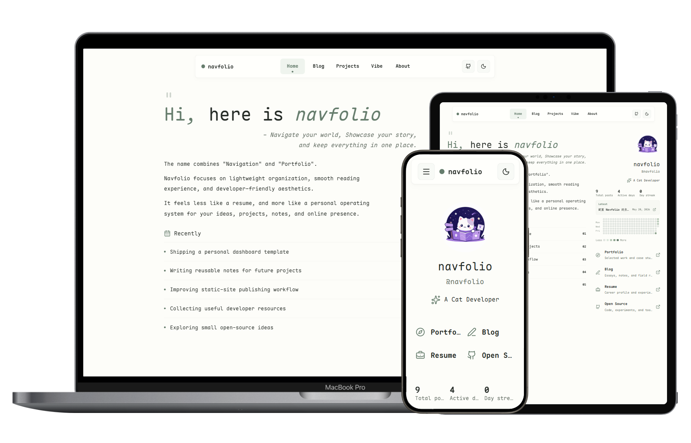

<p align="center">
  
</p>

<p align="center">
  一个基于 Astro 的安静个人发布空间 starter：主页、博客、项目文档、Vibe 碎片、全文搜索、评论系统和主题色盘都在同一个可维护的静态站点里。
  <br />
  <sub>适合内容优先的个人网站，强调克制视觉、轻量交互和 Markdown / MDX 内容管理。</sub>
</p>

<p align="center">
  <a href="./README.md">简体中文</a>
  ·
  <a href="./README.en.md">English</a>
  ·
  <a href="https://astro.navfolio.site/">在线预览</a>
  ·
  <a href="https://astro.navfolio.site/blog/">模块手册</a>
</p>

<p align="center">
  
</p>

_效果图来自 @Lruihao 提供的[设备预览网页](https://github.com/Lruihao/vue-el-demo)。_

## Navfolio 是什么

Navfolio 把个人导航、作品集、博客、项目文档和轻量数字花园整合到一个 Astro 静态站点里。它不是传统的单页简历，也不是只有文章列表的博客模板，而是一个可以长期生长的个人发布系统。

- 主页负责介绍你是谁、你在做什么、读者可以去哪里找到你。
- Blog 负责长文、教程、项目记录和模块使用手册。
- Projects 负责沉淀项目文档和作品说明。
- Vibe 负责更短、更即时的生活片段和开发札记。
- About 负责站点说明、作者信息和友情链接。

在线站点：

- 主页：https://astro.navfolio.site/
- 博客列表：https://astro.navfolio.site/blog/
- GitHub 仓库：https://github.com/dodolalorc/astro-navfolio

## 快速开始

安装依赖：

```sh
bun install
```

启动开发服务器：

```sh
bun run dev
```

构建生产版本：

```sh
bun run build
```

预览生产构建：

```sh
bun run preview
```

## 第一次替换内容

多数个人化内容不需要改组件，优先改这些文件：

```text
src/config/site.toml        站点标题、个人资料、导航、首页模块、评论、搜索、主题
src/content/about.mdx       关于页面
src/content/blog/           博客文章和模块手册
src/content/projects/       项目入口和项目文档
src/content/vibe/           轻量动态和生活碎片
public/images/              Logo、头像、站点预览和静态图片
```

创建内容可以使用内置脚本：

```sh
bun run post:new my-first-post
bun run post:new my-interactive-post --mdx
bun run vibe:new today-cloud
bun run vibe:new photo-note --mdx
```

命令参数是文件 slug，不是最终标题。博客文件会生成到 `src/content/blog/`，Vibe 文件会按现有约定生成到 `src/content/vibe/` 并带日期前缀。

## 路由

```text
/                 个人仪表盘主页
/blog             写作归档与模块手册
/blog/[slug]      博客文章页
/projects         项目文档入口
/projects/[slug]  项目详情文档
/vibe             短记录时间流
/about            关于页面
/rss.xml          RSS feed
```

## 模块使用手册

Navfolio 的模块说明都写成了真实博客内容，位于 `src/content/blog/`，也会出现在在线博客列表里。

| 模块               | 本地内容                                             | 在线阅读                                                         |
| ------------------ | ---------------------------------------------------- | ---------------------------------------------------------------- |
| 站点配置和首页数据 | `src/content/blog/toml-site-config-guide.md`         | https://astro.navfolio.site/blog/toml-site-config-guide/         |
| 主题色盘           | `src/content/blog/theme-palettes.mdx`                | https://astro.navfolio.site/blog/theme-palettes/                 |
| 全文搜索           | `src/content/blog/site-search-module-guide.md`       | https://astro.navfolio.site/blog/site-search-module-guide/       |
| 评论系统           | `src/content/blog/add-comment-system-to-navfolio.md` | https://astro.navfolio.site/blog/add-comment-system-to-navfolio/ |
| Vibe 短记录        | `src/content/blog/vibe-content-guide.mdx`            | https://astro.navfolio.site/blog/vibe-content-guide/             |
| 友链卡片           | `src/content/blog/friend-link-card.mdx`              | https://astro.navfolio.site/blog/friend-link-card/               |
| Markdown 渲染示例  | `src/content/blog/markdown-style-guide.md`           | https://astro.navfolio.site/blog/markdown-style-guide/           |

## 站点配置

站点级信息集中在 `src/config/site.toml`：

- `[config.site]`：站点标题、描述、仓库地址和页脚说明。
- `[config.profile]`：作者名称、账号、身份、头像、网站、GitHub、邮箱等信息。
- `[[config.topNav.links]]`：顶部导航链接。
- `[config.theme]`：内置色盘选择。
- `[config.search]`：搜索入口、快捷键、占位文案和结果数量。
- `[config.comments]`：评论开关和评论提供方。
- `[config.vibe]`：Vibe 时间流显示行为。
- `[config.home]`：首页引语、介绍、导航卡片、联系方式和当前关注事项。

配置结构由 `src/content.config.ts` 中的 Zod schema 校验。字段缺失或类型不对时，`bun run build` 会直接报错，方便早发现。

## 内容模型

博客文章、项目文档和 About 页面共用文章 schema：

```yaml
title: '文章标题'
description: '用于归档页和元信息的简短摘要。'
date: '2026-05-18'
draft: false
heroImage: '/src/assets/figure/example.png'
showHeroImage: true
tags:
  - Astro
comments: true
sidebar:
  enable: true
  toc: true
  relatedPosts: true
```

`sidebar` 控制文章辅助区：

- `enable`：是否启用侧栏区块。
- `toc`：是否展示目录导航。
- `relatedPosts`：是否展示相关文章。

普通博客文章默认适合展示阅读工具；`/about` 和部分项目页可以设置为无侧栏、居中阅读。

## 搜索

Navfolio 使用 Pagefind 生成静态全文搜索索引。顶部导航的搜索按钮支持点击打开，也支持 `Ctrl+K` / `Cmd+K` 快速唤起。

```toml
[config.search]
enabled = true
shortcut = "mod+k"
placeholder = "Search notes..."
maxResults = 6
```

`bun run build` 会先执行 Astro 构建，再为 `dist` 生成 `dist/pagefind` 索引。开发环境如果还没有生产索引，搜索弹层会显示索引不可用提示；运行一次生产构建后可用 `bun run preview` 检查完整搜索体验。

## 评论

Navfolio 支持可配置评论系统：

- `giscus`
- `utterances`
- `waline`
- `none`

统一配置在 `src/config/site.toml`：

```toml
[config.comments]
enabled = true
provider = "giscus"
show_on_posts = true
```

单篇文章也可以在 frontmatter 中关闭评论：

```yaml
comments: false
```

## 部署

站点会构建为 `dist` 中的静态文件，可以部署到 GitHub Pages、Vercel、Netlify、Cloudflare Pages，或任何支持 Astro 静态输出的平台。

GitHub Pages 项目页可使用仓库内置 workflow。`astro.config.mjs` 会根据 GitHub Actions 环境自动处理项目页 `base`，也可以手动覆盖：

```sh
SITE_URL=https://example.com SITE_BASE=/astro-navfolio bun run build
```

## 项目结构

```text
public/
  images/                 Logo、预览图和静态图片
src/
  assets/                 内容图片和本地字体
  components/
    article/              文章头部组件
    blog/                 顶部导航、搜索、目录和相关文章
    cards/                首页卡片组件
    comments/             评论提供方组件
    layout/               首页仪表盘布局
    mdx/                  MDX 内容组件
    widgets/              写作活动和工具组件
    Icon.astro            统一图标适配器
  content/
    about.mdx             关于页面内容
    blog/                 博客 Markdown / MDX 和模块手册
    projects/             项目入口和项目文档
    vibe/                 轻量短记录
  config/site.toml        站点配置
  data/site.ts            TOML 配置读取 helper
  layouts/                基础布局和文章布局
  pages/                  Astro 路由
  styles/                 全局主题、色盘、排版和布局变量
```

## 技术栈

- Astro 6
- Bun
- Tailwind CSS 4 through Vite
- Pagefind
- `@astrojs/mdx`
- `@astrojs/rss`
- `@astrojs/sitemap`
- `lucide-astro`
- `sharp`

## 设计方向

Navfolio 希望呈现为一个安静的开发者笔记本：

- 内容优先；
- 柔和但有结构；
- 克制的阴影和边框；
- 稳定的文章阅读节奏；
- 轻量动效；
- 避免营销式落地页；
- 长文阅读区域不被视觉噪音打扰。

如果这个 starter 对你有帮助，欢迎在仓库点一个 star：<https://github.com/dodolalorc/astro-navfolio>。
