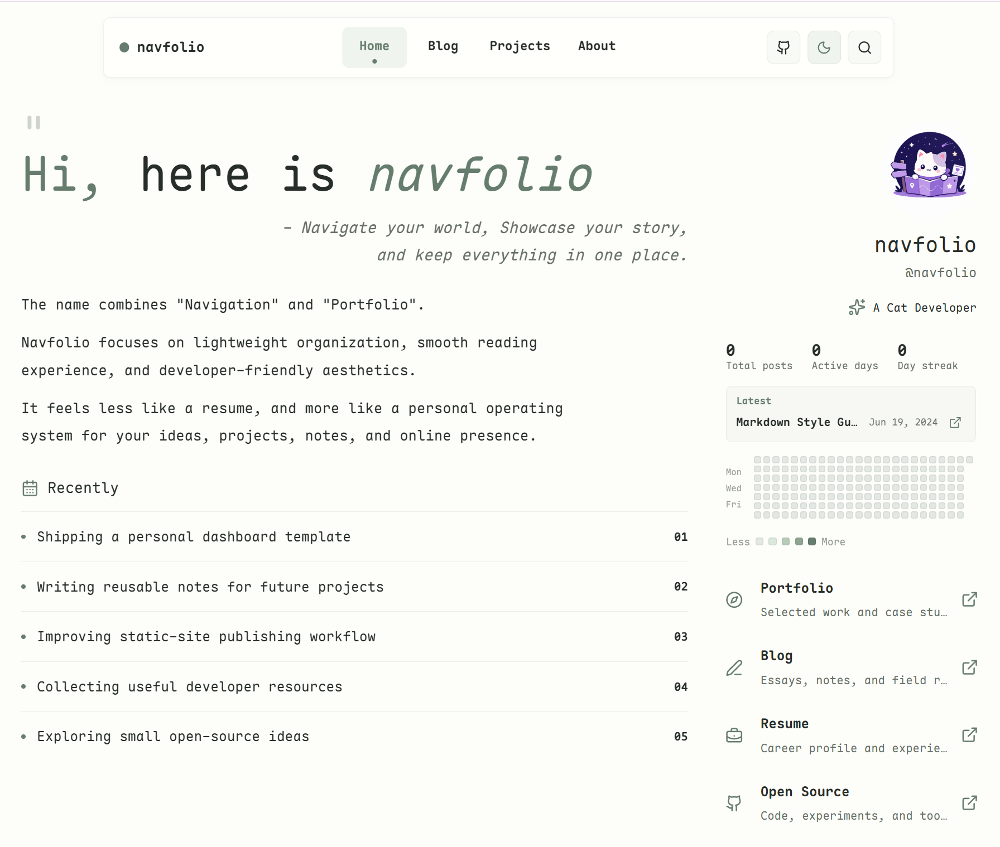
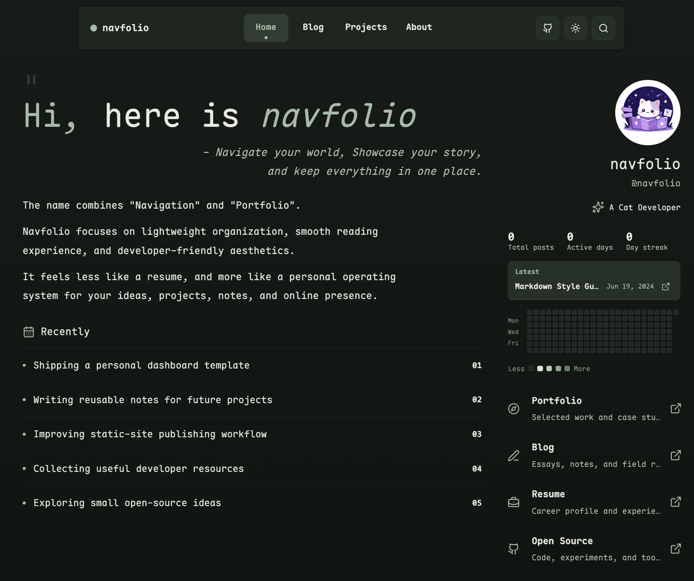

<p align="center">
  
</p>

<p align="center">
  一个基于 Astro 的安静个人发布空间 starter：把主页、博客、项目文档和轻量数字花园结构放进同一个可维护的站点。
  <br />
  <sub>适合内容优先的个人网站，强调克制视觉、轻量交互和 Markdown / MDX 内容管理。</sub>
</p>

<p align="center">
  <a href="./README.md">简体中文</a>
  ·
  <a href="./README.en.md">English</a>
</p>

<p align="center">
  
  &nbsp;&nbsp;
  
  &nbsp;&nbsp;
  
</p>

## 预览

<p align="center">
  
  
</p>

## Navfolio 是什么

Navfolio 把个人导航、作品集、博客和项目文档整合到一个 Astro 静态站点里。它不是传统的单页简历，也不是只有文章列表的博客模板，而是一个可以长期生长的个人发布系统：主页负责快速理解你是谁，博客负责持续写作，Projects 区域负责沉淀项目说明和技术文档。

当前版本重点包括：

- 安静的个人主页：头像、介绍、身份链接、写作活动和当前关注事项；
- `/blog` 写作归档：文章配图、日期、标签和摘要；
- Markdown / MDX 文章页：支持可选目录、标签、阅读时间和相关文章；
- `/projects` 项目入口页：作为项目文档的展示和索引；
- `/projects/[slug]` 项目详情页：记录仓库说明、设计决策和实现细节；
- `/about` 页面：使用同一套文章阅读布局；
- 兼容 GitHub Pages 子路径部署的链接处理。

整体视觉方向是克制的：柔和结构、低阴影、笔记本式排版、轻微动效，以及在明暗主题下都保持可读的图片和正文。

## 路由

```text
/                 个人仪表盘主页
/blog             写作归档
/blog/[slug]      博客文章页
/projects         项目文档入口
/projects/[slug]  项目详情文档
/about            关于页面
/rss.xml          RSS feed
```

## 内容模型

主要内容通过 Markdown / MDX 管理：

```text
src/content/
  about.mdx
  blog/
    first-post.md
    second-post.md
    third-post.md
    ...
  projects/
    index.mdx
    astro-navfolio.mdx
```

博客文章和项目文档共用文章 schema：

```yaml
title: '文章标题'
description: '用于归档页和元信息的简短摘要。'
pubDate: '2026-05-18'
updatedDate: '2026-05-18'
draft: false
tags:
  - Astro
sidebar:
  enable: false
  toc: false
  relatedPosts: false
```

`sidebar` 统一控制文章辅助区域：`enable` 控制是否启用侧栏区块，`toc` 控制目录导航，`relatedPosts` 控制相关文章。普通博客文章默认在有内容时展示阅读工具；`/about` 和 projects 相关页面默认使用无侧栏、居中的文章布局。

## 首页配置

首页与站点信息集中在 `src/config/site.toml`：

- `site`：站点标题、描述、首页标题、仓库地址和页脚说明。
- `profile`：名称、账号、身份、头像、网站、GitHub、邮箱等信息。
- `topNav.links`：顶部导航链接。
- `home.quote` / `home.intro`：首页标语和主介绍文案。
- `home.navigation` / `home.connect`：首页身份入口、联系方式和站内入口。
- `home.doing`：当前关注事项。

首页尽量保持数据驱动。替换 starter 内容时，大多数情况下只需要修改数据和 Markdown / MDX 文件，不需要改组件内部逻辑。

## 功能

- Astro 6 静态站点架构。
- Markdown / MDX 内容集合。
- 文章布局支持目录、标签、阅读时间和相关文章。
- 独立 Projects 区域和项目文档路由。
- 顶部导航支持明暗主题切换和仓库链接。
- 响应式个人主页布局。
- RSS 和 Sitemap。
- GitHub Pages 部署工作流，并支持项目页 base path。
- 基于 `lucide-astro` 的统一图标适配器。
- 本地字体配置和全局 CSS 变量。

## 技术栈

- Astro 6
- Bun
- Tailwind CSS 4 through Vite
- `@astrojs/mdx`
- `@astrojs/rss`
- `@astrojs/sitemap`
- `lucide-astro`
- `sharp`

## 快速开始

安装依赖：

```sh
bun install
```

启动开发服务器：

```sh
bun run dev
```

构建生产版本：

```sh
bun run build
```

预览生产构建：

```sh
bun run preview
```

## 项目结构

```text
public/
  images/                 Logo、预览图和主页图片
src/
  assets/                 博客占位图和本地字体
  components/
    article/              文章头部组件
    blog/                 博客导航、目录和相关文章
    cards/                首页卡片组件
    layout/               首页仪表盘布局
    widgets/              写作活动和工具组件
    Icon.astro            统一图标适配器
  content/
    blog/                 博客 Markdown / MDX
    projects/             项目入口和项目文档
    about.mdx             关于页面内容
  config/site.toml        站点、个人资料、导航和首页内容配置
  data/site.ts            TOML 配置读取 helper
  layouts/                基础布局和文章布局
  pages/                  Astro 路由
  styles/global.css       全局主题、排版和布局变量
astro.config.mjs          Astro、Sitemap、MDX、字体和 base path 配置
```

## 部署

站点会构建为 `dist` 中的静态文件。

GitHub Pages 部署可以使用仓库内置 workflow。配置中会根据 GitHub Actions 环境自动处理仓库项目页的 `base`，也可以手动覆盖：

```sh
SITE_URL=https://example.com SITE_BASE=/astro-navfolio bun run build
```

## 设计说明

Navfolio 希望呈现为一个安静的开发者笔记本：

- 内容优先；
- 柔和但有结构；
- 克制的阴影和边框；
- 稳定的文章阅读节奏；
- 轻量动效；
- 避免营销式落地页；
- 长文阅读区域不被视觉噪音打扰。

这个项目也为 AI 协作迭代做了组织准备。`.agents/skills` 和 `.agents/reviewers` 中记录了当前视觉语言和自检标准，方便在后续开发中保持一致。
